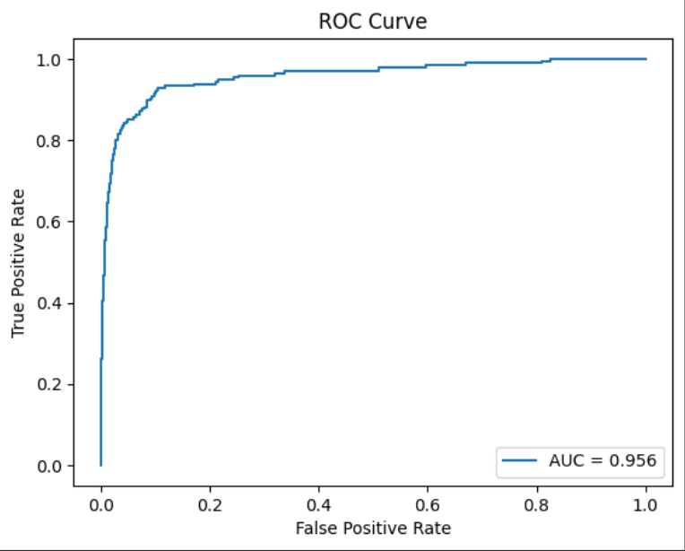

# 🔭 Gravitational Lens Detection using Deep Learning

## 📌 Overview

This project focuses on detecting **strong gravitational lenses** from astronomical image data using deep learning. The goal is to classify images into **lensed** and **non-lensed galaxies**, addressing the challenge of extreme class imbalance in real-world astronomical surveys.

This work is part of the **ML4Sci GSoC Test Task**.

---

## 📂 Dataset

The dataset consists of simulated astronomical observations:

* Each sample is a NumPy array of shape **(3, 64, 64)** representing three observational filters.
* Data is divided into:

  * `train_lenses/`
  * `train_nonlenses/`
  * `test_lenses/`
  * `test_nonlenses/`

### Key Challenge

* The dataset is **highly imbalanced**:

  * Non-lensed galaxies >> Lensed galaxies

---

## 🧠 Approach

### 🔹 Data Processing

* Loaded `.npy` files using a custom PyTorch `Dataset`
* Resized images from **64×64 → 224×224** to match model input
* Converted data to tensors

---

### 🔹 Model

* Used **ResNet18 (pretrained on ImageNet)** as baseline
* Modified final layer for binary classification

```python
model.fc = nn.Linear(model.fc.in_features, 2)
```

---

### 🔹 Handling Class Imbalance

To mitigate bias toward the majority class:

* Used **weighted cross-entropy loss**

```python
criterion = nn.CrossEntropyLoss(weight=class_weights)
```

---

### 🔹 Training Details

* Optimizer: Adam
* Learning rate: 0.001
* Epochs: 5
* Batch size: 32

---

## 📊 Evaluation

### Metrics Used

* **ROC Curve (Receiver Operating Characteristic)**
* **AUC Score (Area Under Curve)**

These metrics are preferred over accuracy due to dataset imbalance.

---

## 📈 Results

* **AUC Score: 0.956**

The ROC curve demonstrates strong separation between lensed and non-lensed classes.

---

## 📷 ROC Curve



---

## 🔍 Error Analysis

* Some **spiral galaxies** and **ring-like structures** were misclassified as lenses
* Low signal-to-noise images caused occasional false negatives

---

## 🚀 Future Improvements

* Use **Vision Transformers (ViT)** for better feature extraction
* Explore **Equivariant Neural Networks** for rotational invariance
* Apply **data augmentation** to improve generalization
* Experiment with **Focal Loss** for better imbalance handling

---

## ⚙️ How to Run

### 1. Clone the repository

```bash
git clone https://github.com/ekramzafar/ml4sci-lens-finding
cd ml4sci-lens-finding
```

### 2. Install dependencies

```bash
pip install torch torchvision numpy matplotlib scikit-learn
```

### 3. Run notebook

Open:

```
lens_detection_ml4sci.ipynb
```

---

## 📁 Repository Structure

```
ml4sci-lens-finding/
│
├── lens_detection_ml4sci.ipynb
├── roc_curve.png
└── README.md
```

---

## 👤 Author

**Ekram Zafar**

* B.Tech CSE, JIS College of Engineering
* Interested in Machine Learning & AI

---

## 🏁 Conclusion

This project demonstrates a robust deep learning pipeline for gravitational lens detection. Despite dataset imbalance, the model achieves high performance, making it a strong baseline for further research in astrophysical image analysis.

---
